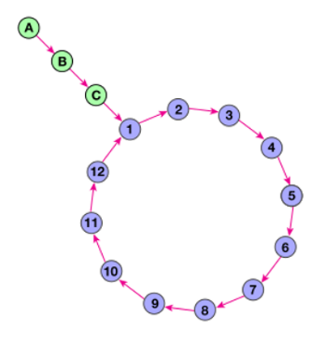

## Find the loop size

You are given a node that is the beginning of a linked list. This list always contains a tail and a loop. Your objective is to determine the length of the loop.

For example in the following picture the tail's size is 3 and the loop size is 12:

    # Use the `next' attribute to get the following node
    node.next

Note: do NOT mutate the nodes!